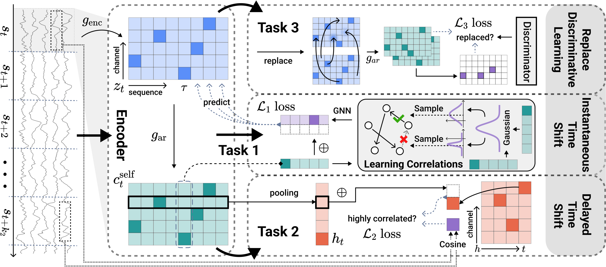

# *MBrain*: A Multi-channel Self-Supervised Learning Framework for Brain Signals (KDD'23)
<div align="center">

### [<a href="https://dl.acm.org/doi/pdf/10.1145/3580305.3599426" target="_blank">Paper</a>] [<a href="figs/MBrain_KDD23_Slides.pdf" target="_blank">Slides</a>] [<a href="https://dl.acm.org/doi/suppl/10.1145/3580305.3599426/suppl_file/rtfp1348-2min-promo.mp4" target="_blank">Video</a>] [<a href="figs/MBrain_KDD23_Poster.pdf" target="_blank">Poster</a>]

_**[Donghong Cai<sup>*</sup>](https://ilikevegetable.github.io/), [Junru Chen<sup>*</sup>](https://mrnobodycali.github.io/), [Yang Yang<sup>†</sup>](http://yangy.org/), Teng Liu, Yafeng Li**_

Zhejiang University, Nuozhu Technology Co., Ltd.

</div>

MBrain is a general multi-channel self-supervised learning framework to unify the representations learning of EEG and SEEG brain signal data.



**Due to the requirements of our cooperated hospital and company, we are unable to public our private SEEG data and all the corresponding data pipeline (including dataloader) now.**

## Data
We use the Temple University Hospital EEG Seizure Corpus (TUSZ) v1.5.2 as our EEG dataset to do seizure detection experiments, which is publicly available [here](https://isip.piconepress.com/projects/tuh_eeg/). We used the code from [eeg-gnn-ssl](https://github.com/tsy935/eeg-gnn-ssl) to read the EEG data and sampled from the complete dataset to generate the self-supervised training set and downstream task datasets. Running the following code to clone the code from eeg-gnn-ssl:
```
cd BrainSignalSSL_EEG/data
git clone https://github.com/tsy935/eeg-gnn-ssl.git
mv eeg_sampling.ipynb eeg-gnn-ssl
```
Then, refer to the code in `./BrainSignalSSL_EEG/data/eeg-gnn-ssl/eeg_sampling.ipynb` to generate the dataset for this experiment.

For the emotion recognition experiments conducted in appendix, we use the SJTU Emotion EEG Dataset (SEED), which is publicly available [here](https://bcmi.sjtu.edu.cn/home/seed/). After downloading this dataset, you can refer to the code in `./BrainSignalSSL_EEG_Emo/data/eeg_emotion_sampling.ipynb` to process the raw data and generate the self-supervised training set and downstream task datasets for experiments.

## Experiments
### Self-Supervised Learning
To pretrain MBrain in EEG dataset for seizure detection, run:
```
python ./BrainSignalSSL_EEG/ssl_train.py --data_dir <path_to_your_data> --save_dir <path_to_save_ssl_model>
```
where `<path_to_your_data>` and `<path_to_save_ssl_model>` is the path to your generated EEG dataset and the path to save checkpoints of MBrain.

Similarly, to pretrain MBrain in dataset for emotion recognition, run:
```
python ./BrainSignalSSL_EEG_Emo/ssl_train.py --data_dir <path_to_your_data> --save_dir <path_to_save_ssl_model>
```

### Downstream Task
After self-supervised pre-training, to do seizure detection downstream task, run:
```
python ./BrainSignalSSL_EEG/downstream_repeat.py --ssl_dir <path_to_ssl_checkpoint> --data_dir <path_to_your_data> --save_dir <path_to_save_downstream_model>
```
where `<path_to_ssl_checkpoint>` is the path to pre-trained checkpoint of MBrain, `<path_to_your_data>` is the path to your generated EEG dataset, and `path_to_save_downstream_model` is the path to save checkpoints of downstream model.

This code will do a five times repeat experiment of downstream task. Which means we will train downstream model and test for 5 times using different random seed.

Similarly, after self-supervised pre-training, to do emotion recognition downstream task, run:
```
python ./BrainSignalSSL_EEG_Emo/downstream_repeat.py --ssl_dir <path_to_ssl_checkpoint> --data_dir <path_to_your_data> --save_dir <path_to_save_downstream_model>
```

## About SEEG
As mentioned in our paper, due to variations in the number of channels and epileptic patterns across different patients, as well as the need to predict epileptic activity at the channel level (unlike EEG, which makes predictions for an entire segment), seizure detection on SEEG is significantly more challenging than on EEG. Moreover, the data processing workflow and the design of the dataloader for the Domain Generalization Experiment are considerably more complex. However, due to the requirements of our cooperated hospital and company, we are currently unable to open-source this part of the dataset and code. If you are also working on self-supervised learning training involving varying numbers of channels and channel-level downstream prediction tasks, we believe the code in `./BrainSignalSSL_SEEG` will still provide valuable insights. Lastly, we are committed to continuing efforts toward open-sourcing SEEG data and its associated pipeline.

## Citation
Please consider citing the following paper when using this code for your application.
```
@inproceedings{10.1145/3580305.3599426,
  title = {MBrain: A Multi-channel Self-Supervised Learning Framework for Brain Signals},
  author = {Cai, Donghong and Chen, Junru and Yang, Yang and Liu, Teng and Li, Yafeng},
  booktitle = {Proceedings of the 29th ACM SIGKDD Conference on Knowledge Discovery and Data Mining},
  publisher = {Association for Computing Machinery},
  pages = {130–141},
  year = {2023},
  isbn = {9798400701030},
  url = {https://doi.org/10.1145/3580305.3599426},
  doi = {10.1145/3580305.3599426},
  numpages = {12},
  series = {KDD '23}
}
```
